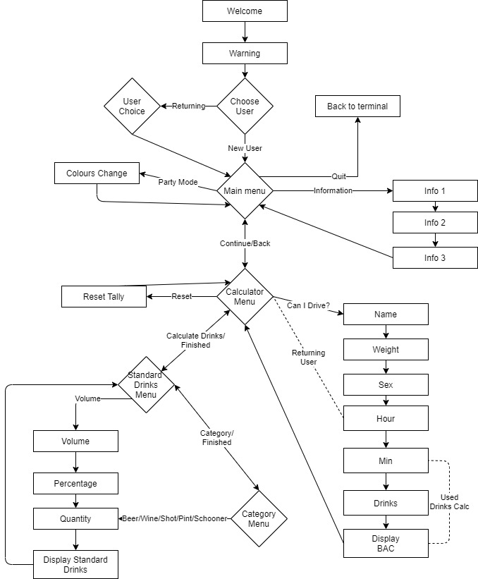

# Software Development Plan
### Purpose and Scope
The purpose of the Can I Drive? terminal application is to practice and develop fundamental programming skills and knowledge.  In particular the language of Ruby, Git and command line.  The application I will develop is called Can I Drive? and sets out to answer that question.  The user will be able to input the time they began drinking and the number of standard drinks they have consumed and the application will be able to tell them their current blood alcohol concentration (BAC) and if they are able to drive under the legal limit.  The user will also be able to calculate the number of drinks they have drunk if they haven’t been keeping track.  Information about BAC and the formula used will also be available in the application.

Many people find themselves in a situation where they have had a few drinks and want to know if it would be legal for them to get behind the wheel of a car.  There might be drinks after work on a Friday or you might need to drive to the in-laws after Christmas lunch.  In all these cases a generic rule based on time and sex alone will not provide the accuracy necessary for a decision as important as driving after drinking.  This is where the terminal application shines.  Can I Drive? will provide a more accurate estimation of blood alcohol using mathematics and metrics unique to each user.  However, all the maths is done behind the scenes allowing a friendly user experience.

Can I Drive? is for everyone that enjoys a drink or two and needs to drive.  Anyone that has computer and can find their way to the help file will be able to use the application.  A user will interact with the application through keyboard commands and text will be displayed in the console.  Menus will explain how to navigate.  Important information such as if the user is under the legal limit will be displayed very clearly. 


### Features
Calculate BAC – Can I Drive? will be able to take user input such as name, weight, sex and time drinking began.  Variables that can be associated with an individual will be part of the user class and variables that change from session to session will be in a drinker class that inherits from user.  Menus will be set up in loops with a break when the user want to go back a level in the menu.  Most input will be selection from menus, so error handling is done with an else statement.  In cases with open keyboard input an exception will be raised with invalid input.  With all the variables assigned Can I Drive? will output the current BAC and an estimated time of when BAC will reach 0.05 if it is over the limit.

Calculate Standard Drinks - When a user doesn’t know how many standard drinks they have consumed they will be able to navigate to a standard drinks calculator.  They will be able to calculate by volume with alcohol content and by category.  Users can use both calculators if needed with a standard drinks variable being updated and displayed each time they add a drink.  Menus will be in nested do loops with case statements and breaks to navigate.  Error handling will be done by raising an exception and asking the user to read the question carefully to facilitate the input of valid data.

Save user Data to file and retrieve – When the user first uses the application the values stored in the User class will be saved to a csv file.  Upon using the application in subsequent sessions, the user will be able to select “Returning User” and will not be required to provide less variable data such as sex and weight again.  On executing the application User profiles will be populated from the csv file without any input from the user.  No restriction will be placed on username to allow for anonymity.

### User Interaction and Experience
The user will be greeted with an information box when they first launch Can I Drive?.  This box will explain how to interact with the program using numbers followed by enter to navigate the menus.  The help box will also explain how to input data through the keyboard when the program asks for a number or word as a response.

The user will navigate through the application with menus.  Each item on the menu will have an associated number.  The user types the number that corresponds with their selection and presses enter.  The menus will have descriptive names allowing an intuitive navigation of the application.  For example, if the user wants to use the calculate standard drinks feature the menu item will say “Calculate Drinks”. There will also be a prompt below the menu to reiterate the function of the menu.

When the application asks for specific inputs the input will be clearly described in the application.  If the input is weight, a positive number is required.  The application will not allow any other kind of input in the field.  Error handling will be set up such that an exception will be raised if an invalid entry is entered.  The user will be notified of the error with a message “Error! Read the question carefully”. The user will then be given another chance to enter the input until they provide a valid entry.  This will be achieved by looping around the error handling.

### Control Flow Diagram

### Implementation Plan

[Trello](https://trello.com/b/oPIScicA/can-i-drive)
### How to Install and Use
The application requires a computer with access to command line interface.  Ruby version of at least 2.5.1 is also a requirement with the Ruby gem Bundler installed. In the terminal the following commands can be used to install Ruby and Bundler.

Install Ruby (On Linux):
```
sudo apt-get install ruby
```
Install Bundler Gem:
```
gem install bundler
```
With these installed all that’s left to do is clone the repository from Github and run the following command in the terminal from the root folder.


```
sh -c "\$(curl -fsSL https://raw.githubusercontent.com/davidkerr766/can-i-drive/master/src/run.sh)

```

#### Links
[GitHub](https://github.com/davidkerr766/can-i-drive)
